# PAW PAWTFOLIO

Paw Pawtfolio is a responsive website that acts as a digital scrapbook of my beloved pets. It's purpose is to document and share memories for myself and my partner, and our family and friends. It also showcases my memory book for future potential clients who may want me to develop a memory book for their pets.

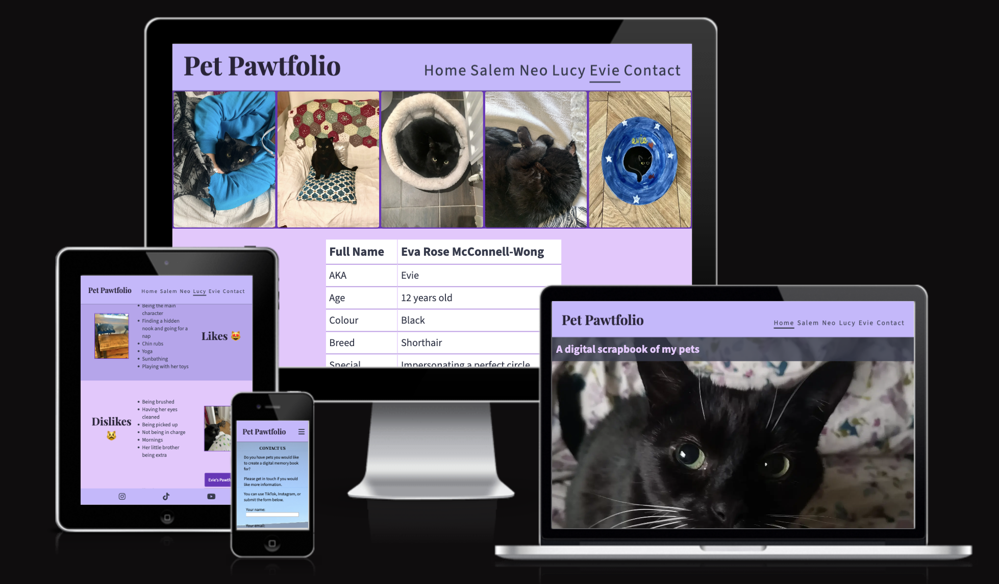

[View Pet Pawtfolio on Github Pages](https://kellie-cat.github.io/portfolio_one_cats/)

---

## CONTENTS

- [PAW PAWTFOLIO](#paw-pawtfolio)
  - [CONTENTS](#contents)
  - [User Experience (UX)](#user-experience-ux)
    - [Key information for the site](#key-information-for-the-site)
    - [User Stories](#user-stories)
      - [Goals](#goals)
      - [First Time User Goals](#first-time-user-goals)
      - [Returning Visitor Goals](#returning-visitor-goals)
  - [Design](#design)
    - [Colour Scheme](#colour-scheme)
    - [Typography](#typography)
    - [Imagery](#imagery)
    - [Wireframes and Google Doc](#wireframes-and-google-doc)
  - [Features](#features)
    - [General features on each page](#general-features-on-each-page)
    - [Future Implementations](#future-implementations)
    - [Accessibility](#accessibility)
  - [Technologies Used](#technologies-used)
    - [Languages Used](#languages-used)
    - [Frameworks, Libraries \& Programs Used](#frameworks-libraries--programs-used)
  - [Deployment \& Local Development](#deployment--local-development)
    - [Deployment](#deployment)
    - [Local Development](#local-development)
      - [How to Fork](#how-to-fork)
      - [How to Clone](#how-to-clone)
  - [Testing](#testing)
    - [User Feedback](#user-feedback)
    - [Resolved Bugs](#resolved-bugs)
    - [Known Bugs](#known-bugs)
  - [Credits](#credits)
    - [Code Used](#code-used)
    - [Content](#content)
    - [Media](#media)
    - [Acknowledgments](#acknowledgments)

---

## User Experience (UX)

Paw Pawtfolio is a website to document memories and pictures of my cats so that I can treasure them and share them with my loved ones.
There is a page for each cat, like a spread in a scrapbook, and also a contact page at the end for any potential clients who may be interested in getting in touch to ask about how I can help create their own Pet Pawtfolio.

### Key information for the site

- An introduction to Pet Pawtfolio and reasons to celebrate our pets.
- A navigation section with pages named after each cat.
- A page dedicated to each cat.
- A contact page for people to get in touch.
- Links to social media pages.

### User Stories

#### Goals

- To have a site that is responsive for screen sizes from handheld devices to larger monitors.
- To have a site that is intuitive and accessible both visually and for people using screen readers.
- To showcase my cats with a site that loads well and all links work.
- To give people contact information so they can contact me to request future projects.

#### First Time User Goals

- I want to learn about the pets.
- I want to view their information and pictures in an aesthetically pleasing way.
- I want to navigate around the site easily.

#### Returning Visitor Goals

- I want familiarity that improves UX by creating an feeling of ease of use.
- I want to contact the page to ask how I can have a Pet Pawfolio for my pets.

## Design

### Colour Scheme

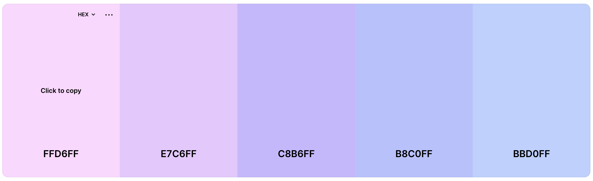

I wanted to use a colour scheme that complemented the monochrome greyscale of the cats, so I was drawn to lilacs and pastel pinks and blues. This palette is popular on [Coolors](https://coolors.co/palette/ffd6ff-e7c6ff-c8b6ff-b8c0ff-bbd0ff).

However, I needed to add contrast for aesthetics and accessibility, so I also decided to pick some bolder colours from the second palette from [Coolors](https://coolors.co/palette/6f2dbd-a663cc-b298dc-b8d0eb-b9faf8) below.

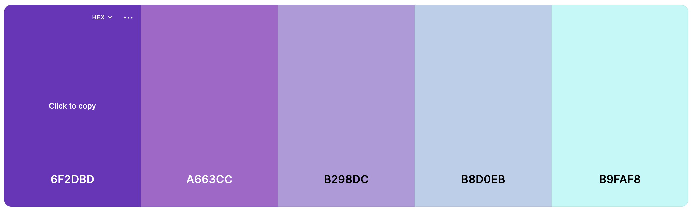

### Typography

[Google Fonts](https://fonts.google.com/) was used for the fonts and [Font Pair](https://www.fontpair.co/all) helped pick a pair that complemented each other.
I decided to use a sans-serif font for the majority of the text for accessibility for screens.
A serif font gave some personality to the headings and added a feel of a traditional photo album.

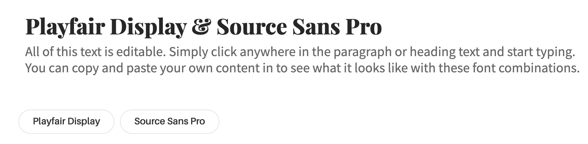

### Imagery

As the purpose of the site is to display personal photos, no stock images were used. Photos of the cats were taken with my phone for the most part and converted to webp format with [Convertio](https://convertio.co/) and compressed to improve the site loading time with [tinyPNG.com](https://tinypng.com/)

### Wireframes and Google Doc

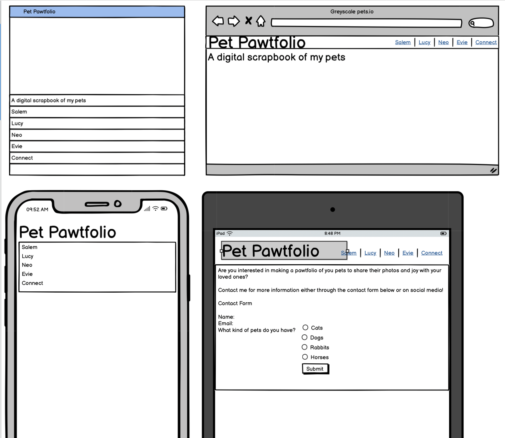
Balsamiq wireframes were trialed to plan the project layout.
A [Google Doc](docs/pet-pawtfolio-google-doc-plan.pdf) was used to plan the content and text, and decide upon the scope of the site.

## Features

### General features on each page

The website has six pages accessible from the landing page (home page, a page for each of the four cats, and a contact page).

- All pages are responsive up to 3500px screen sizes.
  
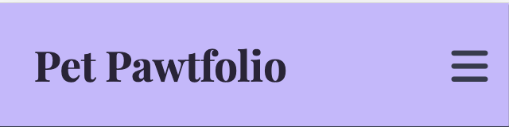

- On every page there is a navigation bar fixed at the top that helps the user navigate the site. As per convention, this has a logo to the left and a navbar to the right of the screen, that is hidden behind a burger toggle on smaller screens. The logo and the Home button will both bring the user to the Home Page.

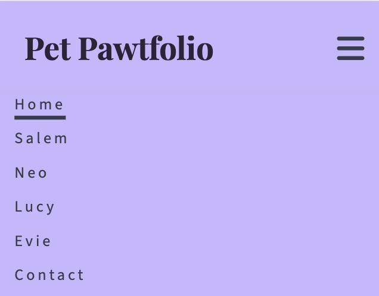

- At the bottom of every page a footer contains links to social media pages with icons from Font Awesome.

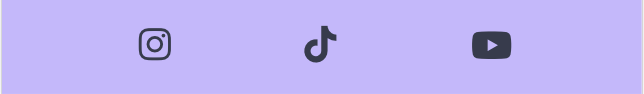

Home page

- The Hero Image is the main focus of the home page. It shows a picture of a beautiful cat with green eyes sitting on a duvet with pastel colours that inspired the colour scheme for the site. The text overlaid on the image explains the function of the site - it is a digital scrapbook of my pets.

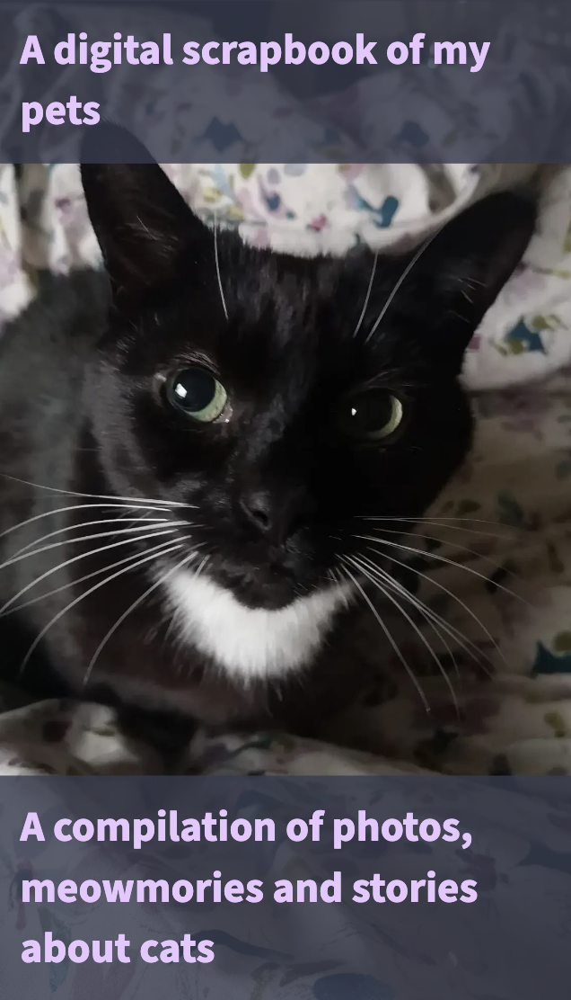

- Underneath the image, a paragraph of text welcomes the user and explains why I love cats so much.

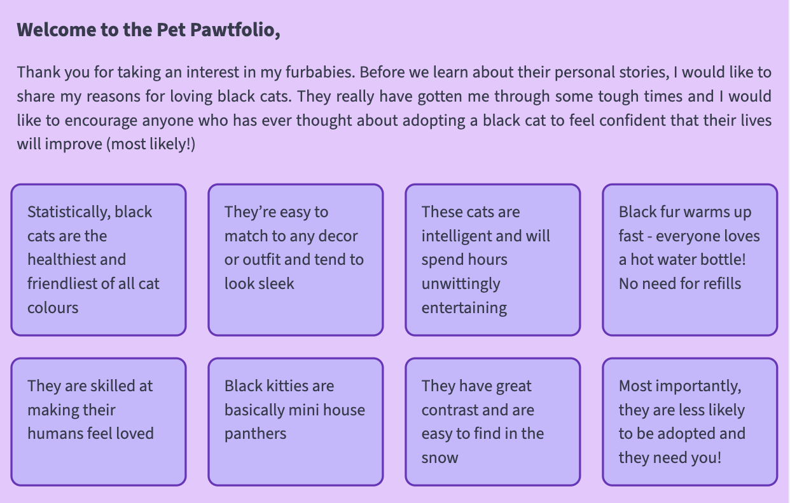

- The reasons section shows eight boxes enclosing eight reasons why cats are great.
  
- Lastly, a button on the lower right of the screen invites the user to flick to the next page of the memory book, improving user experience by avoiding the need to move the mouse back to the navbar.
  
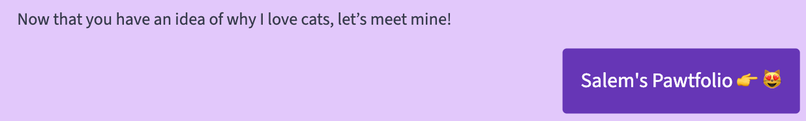

Cats' pages

- Under the header on the cats' pages are a collection of expanding photos that respond to the appropriate screen size. On small mobile devices, one image is seen, on larger mobiles, two images are revealed. On landscape mobiles and tablets, three photos appear, and on larger screens, five photos of the cat fill the width of the screen.

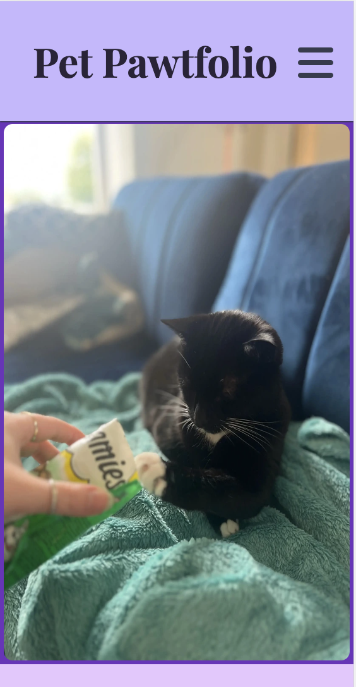

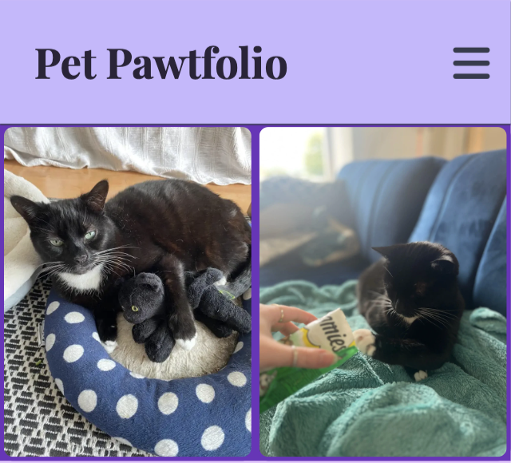

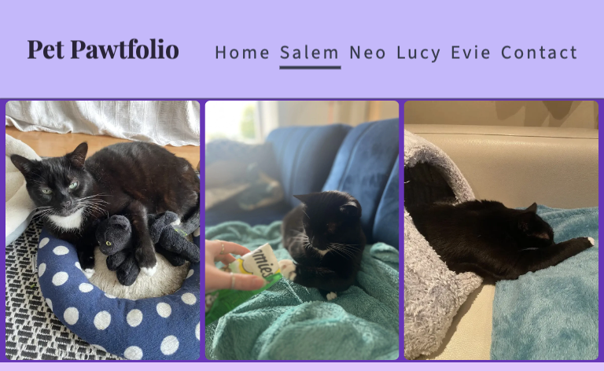

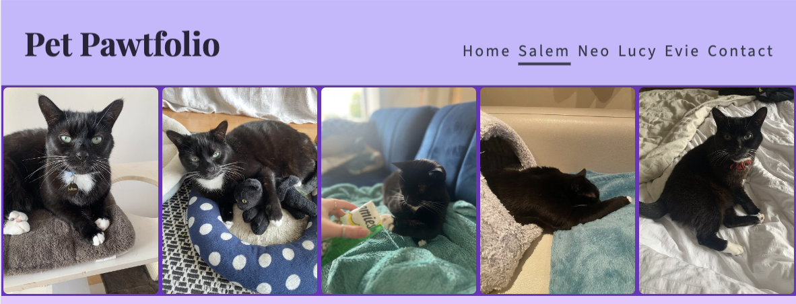

- The Personal Details section introduces the cat with their biography organised within a table. Their name, age, special talents and theme tune are some of the facts highlighted here. A circle image of them adds visual interest to break up the text. This section is also resposive, organised in a column on narrow screens, and moved to a row arrangement as space allows.

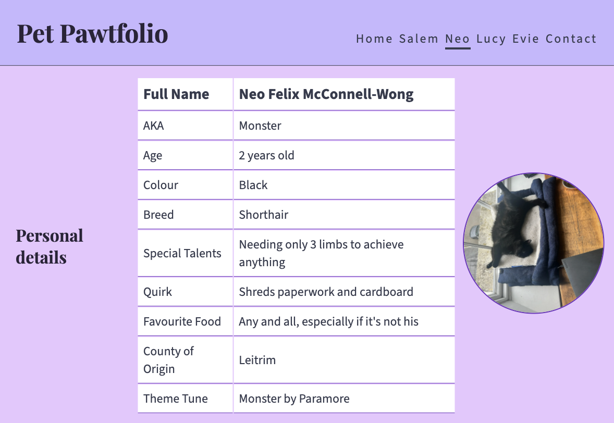

- The Story section allows the user to get to know the star of the page, with more details about their lives and special memories we want to record.

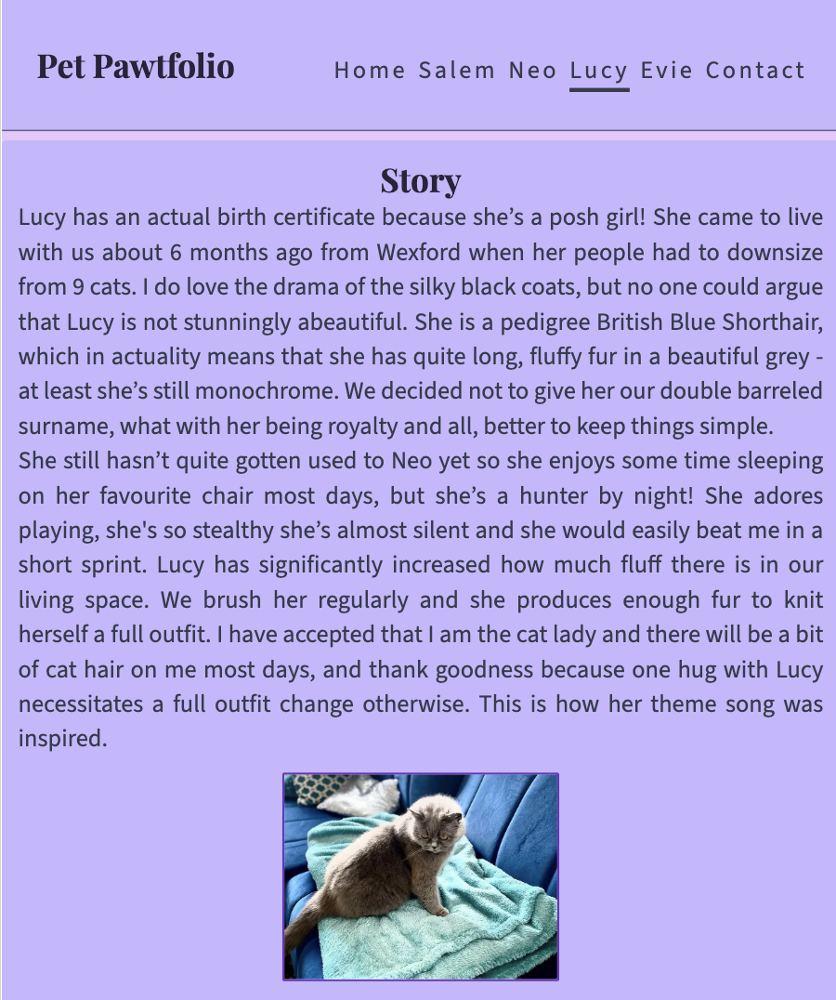

- The Likes and Dislikes sections have different background colours to separate them. They have a heading, a list of likes or dislikes and an accommpanying photo. These are seen in a column on mobiles, and a row on larger screens.
  
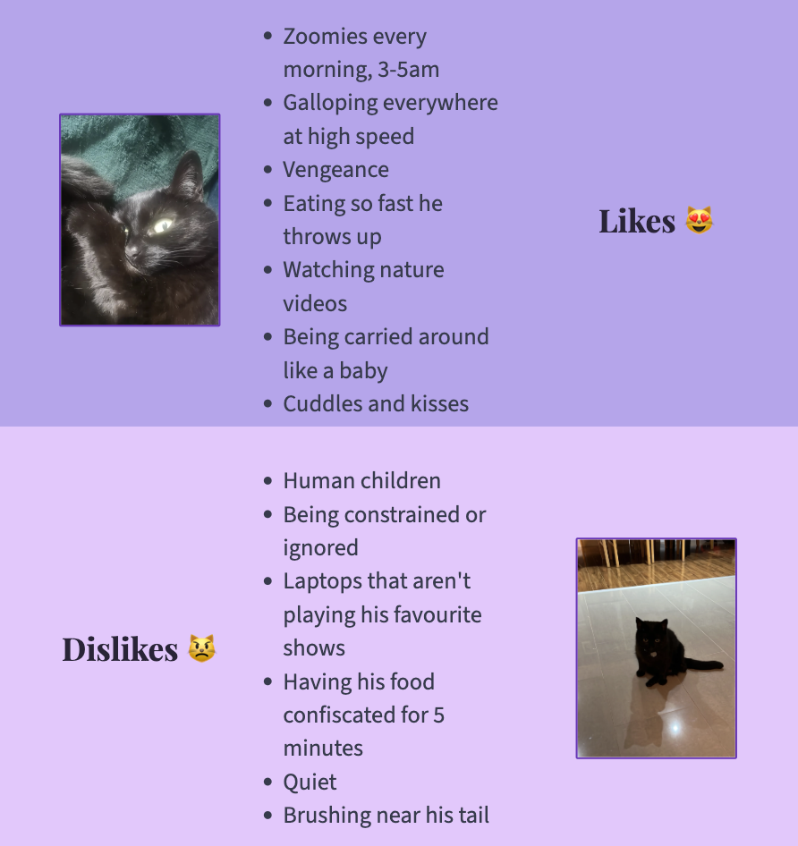

- The Contact Page invites users to complete a form to ask for more information. If they do not complete the required sections properly, the form does not submit. If they complete the required sections, then a Thank you message is displayed.

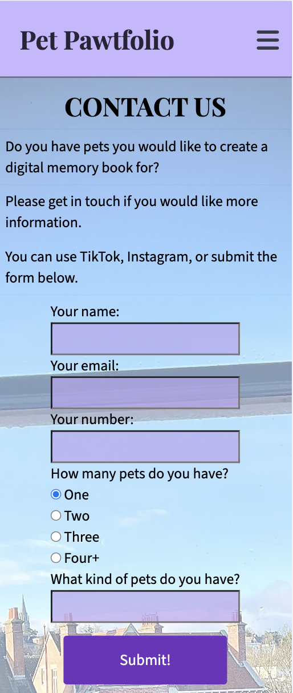

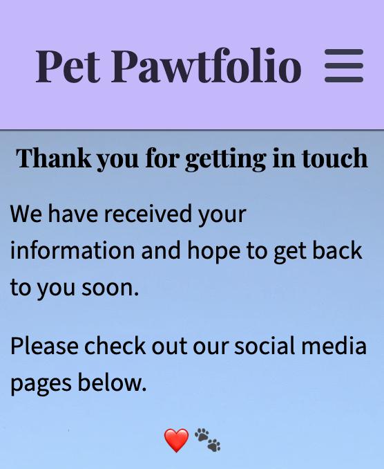

### Future Implementations

- Ideally, more space for photos on each cat's page would be great, as they are very photogenic creatures. A photo reel that could be swiped through with arrows to alert the user to scroll through extra pictures would be a way of displaying all photos even on small devices. I would like to learn how to use Responsive images for different media queries and this could be used to update the page and keep load times as low as feasible in the future.
- The ability to enlarge photos on small screens would be beneficial, especially for people with sight impairments.
- JavaScript would be very useful for the contact page. At present it is just a form, the information is not sent anywhere or stored.
- The photos in the Story section would be visually more interesting if they were integrated into the text to improve the UX on larger screen sizes.
- Going forward, I have learned to give the HTML elements proper classes from the beginning, rather than targetting the element itself, as going back through the code and reclassifying certain elements and looking for the matching CSS is doable. But it can be tedious and lead to issues with the changes taking some time to implement.

### Accessibility

I have tried to be inclusive for everyone when coding this website by

- Using alt attributes on all images to describe them for people using screen readers.
  
- The EightShapes Contrast Grid was helpful with matching background and text colours with good contrast and making sure text is an appropriate size on all types of screen.
  
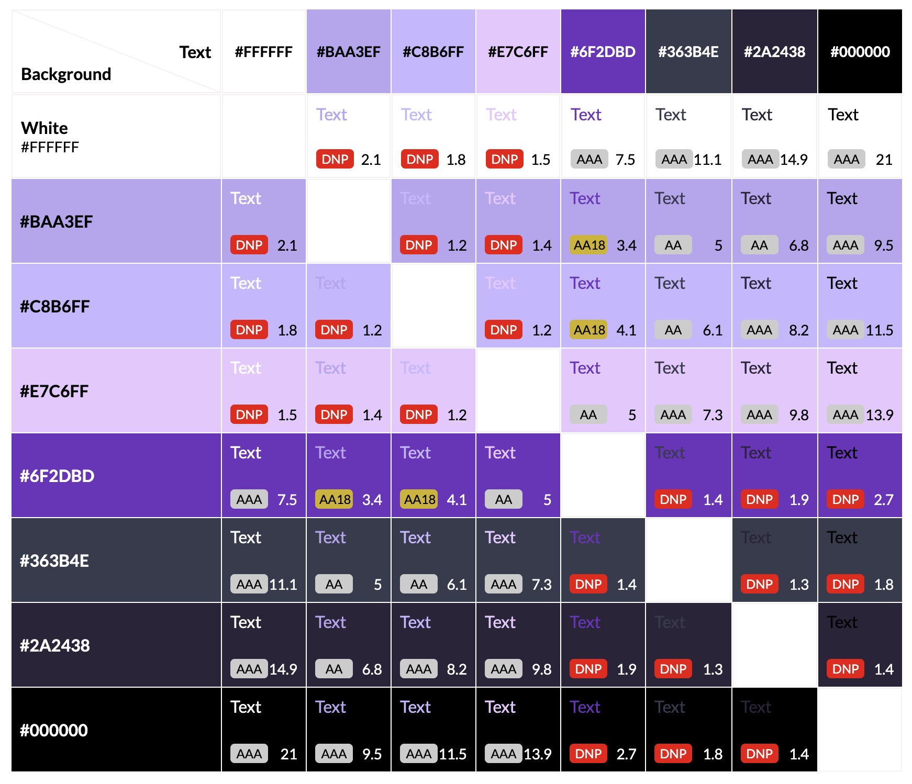
  
- Using semantic HTML as much as possible.
  
- Marking the current page as "active" on the navbar menu.
  
- Testing the website with Wave.

## Technologies Used

### Languages Used

This website was made using HTML and CSS.

### Frameworks, Libraries & Programs Used

[Balsamiq](https://balsamiq.com/givingback/free/classroom/) - Used to create wireframes.

[Github](https://github.com/Code-Institute-Org/ci-full-template) - To save and store files for the website.

[Codeanywhere](https://dashboard.codeanywhere.com/) - To write the code.

[Google Fonts](https://fonts.google.com/) - To import the fonts used.

[Font Pair](https://www.fontpair.co/all) - To find a complementary font pairing.

[Font Awesome](https://fontawesome.com/) - For the icons.

[Coolors](https://coolors.co/) - To choose colours that showcased the greyscale cats.

[EightShapes Contrast Grid](https://contrast-grid.eightshapes.com/) - To improve accessibilty with colours.

Google Chrome Development Tools - To test the code as I was writing it, and to troubleshoot and isolate issues with styling, as well as test accessibilty with Lighthouse.

[Wave](https://wave.webaim.org/) - To evaluate accessibility.

[Convertio](https://convertio.co/) - To convert images to webp format.

[Tinypng](https://tinypng.com/) - To compress images.

[RedKetchup](https://redketchup.io/image-resizer) - To resize images.

[Favicon](https://favicon.io/) - To create favicon.

[Am I Responsive?](https://ui.dev/amiresponsive) - To display the website on a range of screen sizes.

[Shields](https://shields.io) - To display badges in this README.md document.

## Deployment & Local Development

### Deployment

Github Pages was used to deploy the live website. The instructions to achieve this are:

1. Log in (or sign up) to Github.
2. Find the repository for this project, kellie-cat/portfolio_one_cats.
3. Click on the Settings link.
4. Click on the Pages link in the left hand side navigation bar.
5. In the Source section, ensure Deploy from a branch is selected, and choose main from the drop down select branch menu. Select Root from the drop down select folder menu.
Click Save.
Your live Github Pages site is now deployed at the URL shown.

### Local Development

#### How to Fork

To fork the Pet Pawtfolio:

1. Log in (or sign up) to Github.
2. Go to the repository for this project, kellie-cat/portfolio_one_cats.
3. Click the Fork button in the top right corner.

#### How to Clone

To clone the Pet Pawtfolio:

1. Log in (or sign up) to GitHub.
2. Go to the repository for this project, kellie-cat/portfolio_one_cats.
3. Click on the code button, select whether you would like to clone with HTTPS, SSH or GitHub CLI and copy the link shown.
4. Open the terminal in your code editor and change the current working directory to the location you want to use for the cloned directory.
5. Type 'git clone' into the terminal and then paste the link you copied in step 3. Press enter.

## Testing

The website was tested as it was built on Google Chrome using Google Devtools. It was designed with a mobile-first mindset and other screensizes were adjusted using media queries. Other browsers were tested.

HTML validator was used to check all of the HTML and the CSS on the site.

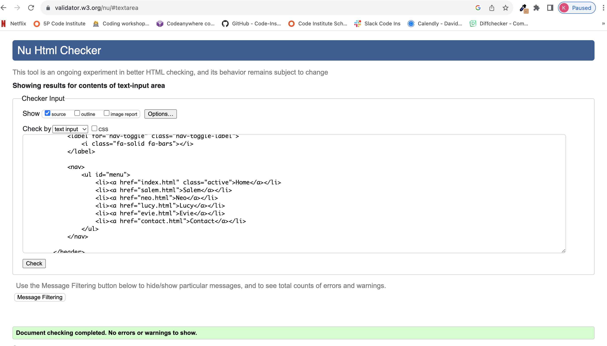
Home page validation

Salem's page validation

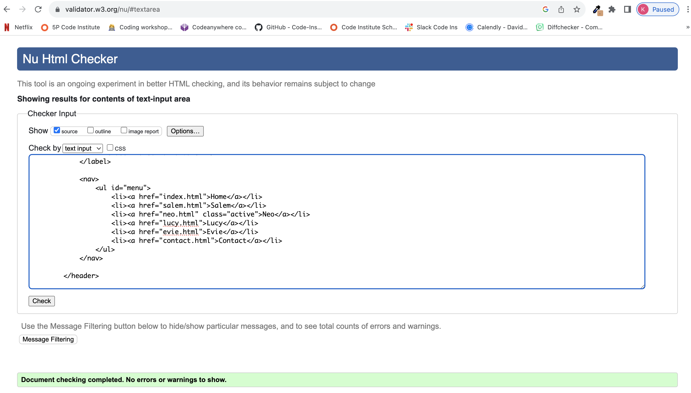
Neo's page validation

Lucy's page validation

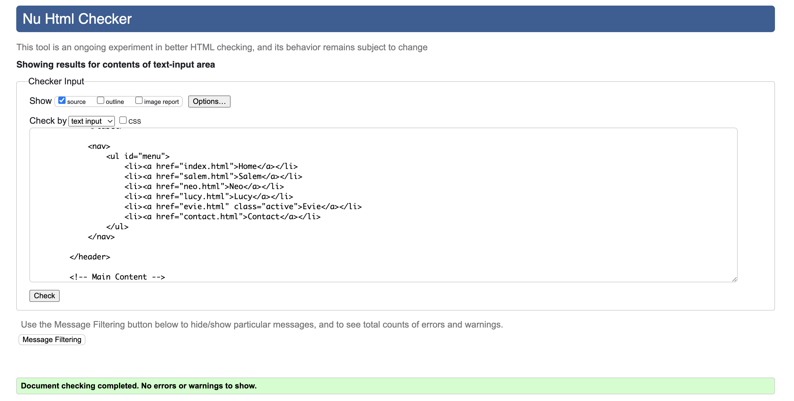
Evie's page validation

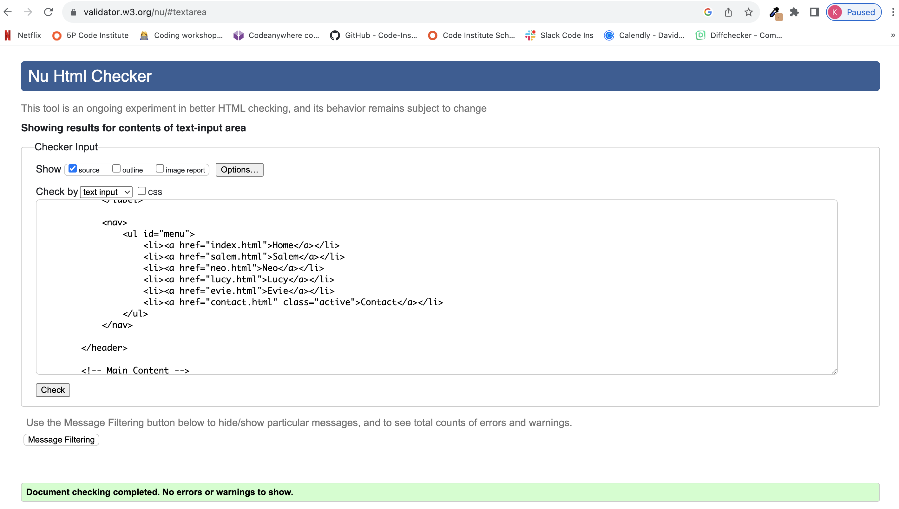
Contact page validation

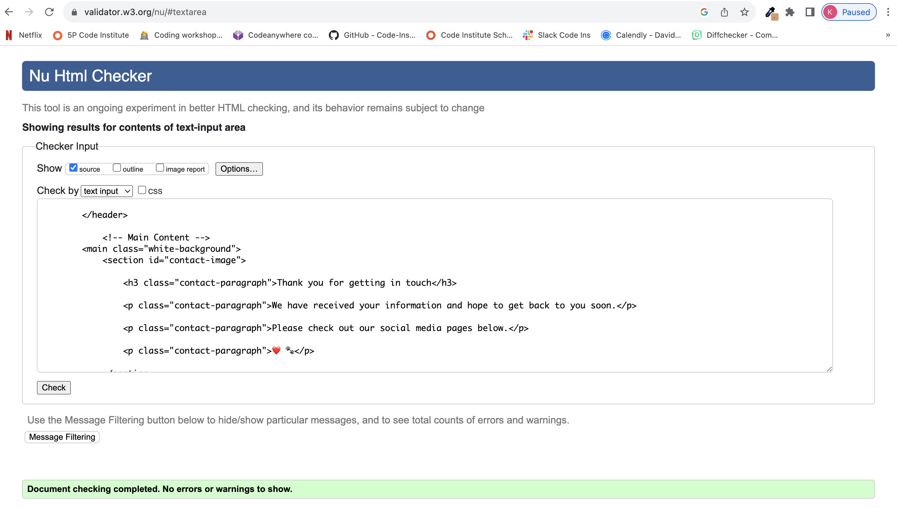
Thank you page validation

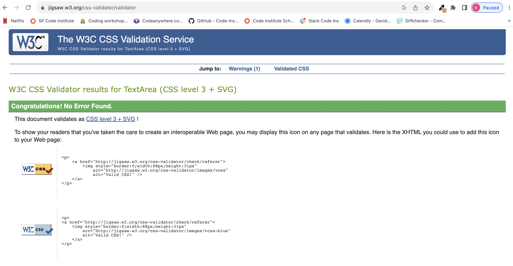
CSS validation

### User Feedback

Two users were asked to give feedback for the site near the end of construction and both recommended to break up the text in the story section, with either paragraphs or more pictures.

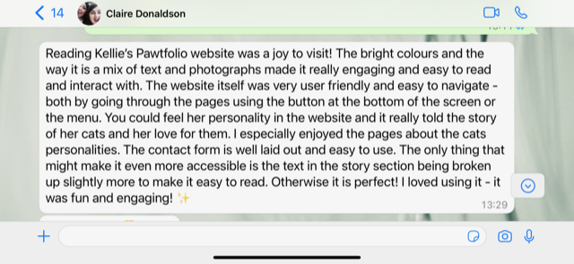

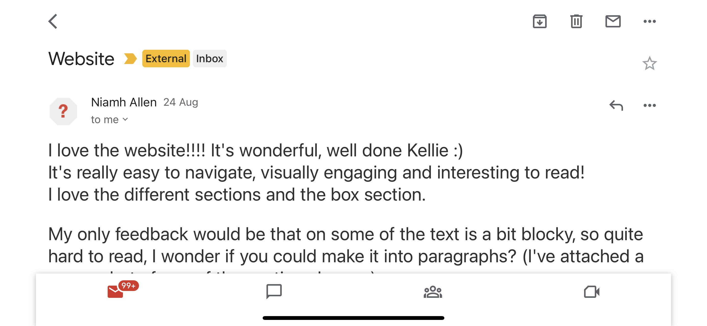

### Resolved Bugs

Many issues were discovered and resolved throughout the project.
I have learned a lot, and hopefully learned how to avoid many issues in future.

1. I wanted to learn to use flexbox for the reasons boxes on the home page. Nothing worked until I read [this guide](https://css-tricks.com/snippets/css/a-guide-to-flexbox/), recommended by fellow coder on Slack. On the 3rd read through, I realised I was adding the display:flex; command to the element, not the parent.
2. After a lot of back and forth with the margin-top command for the hero image and cats main photos, using different values to push them down below the header on different screen sizes, it stopped working properly on small screens for the cat's pages and the top of their photos was under the header. I tried everything. Deleted and rewrote code. Googles for about 20minutes. Logged out of the workspace and logged back in. I asked for help in Tutor Assistance. Hollie kindly checked it out - and everything looked perfect on her screen. When I checked it out on a different computer, all looked fine there too. And when I logged back in the next day, the issue had resolved itself. Sometimes turning it off and turning it on again works for code too.
3. The radio inputs were placed under and to the right of their labels on the contact page. I learned how to wrap the radio input inside the label to have them displayed tirectly to the left of their label, as convention dictates.
4. Codeanywhere kept reformatting my code. This was particularly distracting with the Story section, where the entire paragraph kept reverting to being on one line, and the number of spaces in an indent kept changing back to 2 when I wanted 4. I changed some of the settings to preserve my format and now the code reads much more clearly.
5. Lighthouse flagged that there was no h2 element within the cats-main-photos section. An h2 hidden-heading was added to other pages to conform to semantic layout.

### Known Bugs

There are no unfixed bugs on the Pet Pawtfolio.

## Credits

### Code Used

- [Kera Cudmore's README.md for the Bully Book Club](https://github.com/kera-cudmore/Bully-Book-Club)
- Love Running inspired header and footer
  
### Content

Content was written by Salem, Neo, Lucy and Evie's person, Kellie McConnell.

### Media

Photos were taken by Kellie McConnell and William Wong (2nd person to Salem, Neo, Lucy and Evie).
The photo named evie-wedding was taken by Bruno Rosa for Kellie McConnell and William Wong with full permission given to Kellie McConnell to use in all capacities.
  
### Acknowledgments

Thank you so much to everyone who helped me in this project.

- David Bowers, my Code Institute Mentor, I could not have completed this without your help.
  
- Hollie in Tutor Support, for helping me figure out that code needs patience.

- Claire and Niamh, for taking the time to evaluate the project.
  
- My cats, for providing both the inspiration and content.
  
- My husband, William Wong, for loving football and giving me peace to code.
  